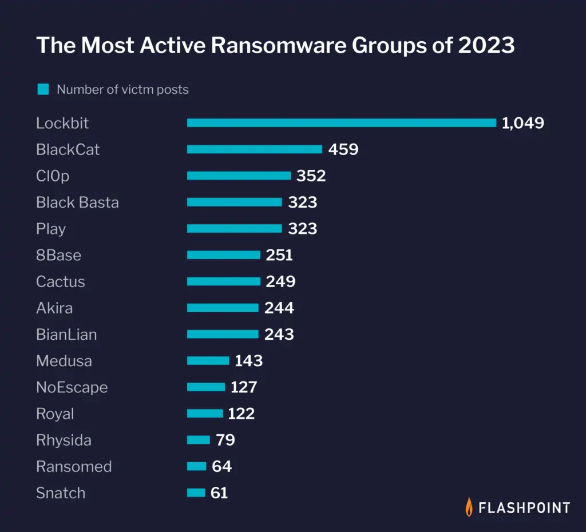

# LockBit-style Ransomware Simulation for NERRF

This document outlines controlled LockBit-style ransomware simulations for NERRF M0 (Research Lock-in) and M1 (Tracker Alpha) milestones. The goal is to define realistic file-level syscalls and encryption behavior within Kubernetes pods to validate the dependency graph and undo planner.

## About LockBit

LockBit is a **Ransomware-as-a-Service (RaaS)** platform active since mid-2019, operated by the **GOLD MYSTIC** group. According to a joint statement by various government agencies, LockBit was the world's most prolific ransomware in 2022. It was estimated in early 2023 to be responsible for `44% of all ransomware` incidents globally. In the United States between January 2020 and May 2023, LockBit was used in approximately `1,700 ransomware attacks`, with $91 million paid in ransom to hackers.

It gains initial access to computer systems using purchased access, unpatched vulnerabilities, insider access, and zero-day exploits, in the same way as other malware. LockBit then takes control of the infected system, collects network information, and steals and encrypts data. Demands are then made for the victim to pay a ransom for their data to be decrypted so that it is again available, and for the perpetrators to delete their copy, with the threat of otherwise making the data public.

### Techniques and tactics

LockBit operators frequently gain initial access by exploiting vulnerable Remote Desktop Protocol (RDP) servers or compromised credentials purchased from affiliates. Initial access vectors also include phishing emails with malicious attachments or links, brute-forcing weak RDP or VPN passwords, and exploiting vulnerabilities such as `CVE-2018-13379` in Fortinet VPNs.

Once installed, LockBit ransomware is often executed in Microsoft Windows via command-line arguments, scheduled tasks, or PowerShell scripts such as PowerShell Empire. LockBit uses tools such as Mimikatz, GMER, Process Hacker, and registry edits to gather credentials, disable security products, and evade defenses. It enumerates network connections to identify high-value targets such as domain controllers using scanners such as Advanced Port Scanner.

For lateral movement, LockBit spreads through SMB file-sharing connections inside networks, using credentials gathered earlier. Other lateral movement techniques include distributing itself via compromised Group Policy objects, or using tools such as PsExec or Cobalt Strike.

LockBit's ransomware payload encrypts files and network shares using AES and RSA encryption. It encrypts only the first few kilobytes of each file for faster processing, and adds a ".lockbit" extension. LockBit then replaces the desktop wallpaper with a ransom note; it can also print ransom notes to attached printers. The goal is to extort payment of a ransom to reverse system disruption and restore file access.

### LockBit Variant Comparison Table

| **Variant**           | **First Seen** | **Key Features / TTPs**                                                                                                                                                                                                     | **Platform**             | **Notable Tools / Mechanisms**                        |
| --------------------- | -------------- | --------------------------------------------------------------------------------------------------------------------------------------------------------------------------------------------------------------------------- | ------------------------ | ----------------------------------------------------- |
| **LockBit (v1)**      | Mid-2019       | • `.abcd` → `.lockbit` extension switch  • Encryption in < 5 min  • Auto-spread via PowerShell & PSExec                                                                                                               | Windows                  | PowerShell, PSExec                                    |
| **LockBit 2.0**       | July 2021      | • Faster string decoding (evasion)  • Auto-encrypts Windows domains via AD GPOs  • Disables Microsoft Defender  • “StealBit” for targeted file exfiltration  • Linux/ESXi sub-variant (“Linux-ESXI Locker 1.0”) | Windows + Linux + ESXi   | StealBit, AD GPO abuse                                |
| **LockBit 3.0**       | June 2022      | • Anti-analysis & password-only execution  • Command-line augmentation  • **Bug bounty program** ($1 k – $1 M)  • Continued speed improvements                                                                     | Windows + Linux + ESXi   | Bug bounty categories: Locker bugs, Tor, Tox, website |
| **LockBit Green**     | Jan 2023       | • High code reuse from Conti  • Same CLI options as Conti  • Targets Windows environments                                                                                                                             | Windows                  | Conti-derived code                                    |
| **LockBit for macOS** | May 2023       | • Mach-O binary (ELF recompile)  • Commands incompatible with macOS  • Version 1.2 “Linux/ESXi locker” base  • **Currently non-functional** – proof-of-concept only                                                | macOS (proof-of-concept) | N/A (non-functional)                                  |

## References

1. [TrendMicro - Rising Threat from LockBit](https://www.trendmicro.com/content/dam/trendmicro/global/en/research/24/b/lockbit-attempts-to-stay-afloat-with-a-new-version/technical-appendix-lockbit-ng-dev-analysis.pdf)
2. [Logpoint Emerging Threats Report – LockBit TTPs](https://www.logpoint.com/wp-content/uploads/2023/07/etp-lockbit.pdf)
3. [Vectra AI – LockBit TTP Map](https://www.vectra.ai/modern-attack/threat-actors/lockbit)
4. [CISA - Understanding Ransomware Threat Actors: LockBit](https://www.cisa.gov/news-events/cybersecurity-advisories/aa23-165a)
5. [CISA & FBI - #StopRansomware: LockBit 3.0](https://www.cisa.gov/news-events/cybersecurity-advisories/aa23-075a)
6. [FBI - Ransomware Investigation](https://www.fbi.gov/investigate/violent-crime/cac/ransomware)
7. [Mandiant - LockBit Ransomware Analysis](https://www.mandiant.com/resources/blog/lockbit-ransomware-analysis)

## **LockBit-Ethical Simulation – M0 & M1 Attack Scenarios**

_Validated on Minikube single-pod workload_

### 1. Scenario Overview

#### M0 (Basic Scale)

| Attribute           | Value                                                                     |
| ------------------- | ------------------------------------------------------------------------- |
| **Threat Family**   | LockBit 3.0 (ethical simulation with reversible encryption, e.g., Fernet) |
| **Scope**           | 1 Kubernetes pod (`m0-victim`)                                            |
| **Payload**         | Python script that encrypts and renames files in `/app/uploads`           |
| **Measurable Goal** | MTTR < 60 s (decision loop + file reversal)                               |
| **Ground-truth**    | Millisecond-precise syscall trace + CSV labels                            |

#### M1 (Enterprise Scale)

| Attribute           | Value                                                                     |
| ------------------- | ------------------------------------------------------------------------- |
| **Threat Family**   | LockBit 3.0 (ethical simulation with reversible encryption, e.g., Fernet) |
| **Scope**           | 1 Kubernetes pod (`m1-victim`)                                            |
| **Payload**         | Python script that encrypts and renames files in `/app/uploads`           |
| **Measurable Goal** | MTTR < 60 s (decision loop + file reversal)                               |
| **Ground-truth**    | Millisecond-precise syscall trace + CSV labels                            |

### 2. Attack Phases & Pseudocode

#### M0 (Basic Scale)

| Phase                    | Description                      | Pseudocode (inside pod)                                                                                        |
| ------------------------ | -------------------------------- | -------------------------------------------------------------------------------------------------------------- |
| **P0 – Seed**            | Deploy 25 files (~13 MB)         | `for i in range(1, 26): write(f"file_{i}.dat", 0.5 MB)`                                                        |
| **P1 – Recon**           | Basic lateral movement           | `enumerate_processes(); enumerate_network()`                                                                   |
| **P2 – Execution**       | Launch ethical simulator         | `python3 /tmp/sim_lockbit.py`                                                                                  |
| **P2.5 – Key Gen**       | Generate encryption key          | `key = Fernet.generate_key(); cipher = Fernet(key)`                                                            |
| **P3 – Encryption Loop** | Encrypt and rename files         | `for f in *.dat: data = read(f); encrypted = cipher.encrypt(data); write(f+".lockbit3", encrypted); remove(f)` |
| **P4 – Ransom Note**     | Drop `README_LOCKBIT.txt`        | `write("README_LOCKBIT.txt", "Files encrypted. Pay to decrypt.")`                                              |
| **P5 – Idle**            | Keep pod alive for trace capture | `sleep 30`                                                                                                     |

#### M1 (Enterprise Scale)

| Phase                    | Description                      | Pseudocode (inside pod)                                                                                        |
| ------------------------ | -------------------------------- | -------------------------------------------------------------------------------------------------------------- |
| **P0 – Seed**            | Deploy 47 files (~110 MB)        | `for i in range(1, 48): write(f"file_{i}.dat", 2-5 MB)`                                                        |
| **P1 – Recon**           | Advanced reconnaissance          | `enumerate_processes(); enumerate_network(); enumerate_disks()`                                                |
| **P2 – Execution**       | Launch ethical simulator         | `python3 /tmp/sim_lockbit_m1.py`                                                                               |
| **P2.5 – Key Gen**       | Generate encryption key          | `key = Fernet.generate_key(); cipher = Fernet(key)`                                                            |
| **P3 – Encryption Loop** | Encrypt and rename files         | `for f in *.dat: data = read(f); encrypted = cipher.encrypt(data); write(f+".lockbit3", encrypted); remove(f)` |
| **P4 – Ransom Note**     | Drop `README_LOCKBIT.txt`        | `write("README_LOCKBIT.txt", "Files encrypted. Pay to decrypt.")`                                              |
| **P5 – Idle**            | Keep pod alive for trace capture | `sleep 60`                                                                                                     |

### 3. Telemetry Capture (eBPF)

| Hook                                   | Purpose          | trace.proto Fields                          |
| -------------------------------------- | ---------------- | ------------------------------------------- |
| `tracepoint/syscalls/sys_enter_openat` | File open events | timestamp, syscall, file_path               |
| `tracepoint/syscalls/sys_enter_write`  | Overwrite volume | timestamp, syscall, file_path, dependencies |
| `tracepoint/syscalls/sys_enter_rename` | Extension change | timestamp, syscall, file_path               |
| `tracepoint/syscalls/sys_enter_unlink` | Cleanup (if any) | timestamp, syscall, file_path               |

| _Note_: Hooks capture partial writes (e.g., first kilobytes) to model LockBit optimization.

### 4. Results

| Metric                               | M0 (Basic)     | M1 (Enterprise)     | Improvement                  |
| ------------------------------------ | -------------- | ------------------- | ---------------------------- |
| **Scale**                            | Basic workload | Enterprise workload | 🔼                           |
| **Files Encrypted**                  | 25 files       | 47 files            | 1.9× more                    |
| **Data Volume**                      | 12.5 MB        | 110 MB              | 8.8× larger                  |
| **Avg File Size**                    | 0.5 MB         | 2.0 MB              | 4× larger                    |
| **Trace Events** (syscalls via eBPF) | 88 events      | 155 events          | 1.8× more                    |
| **Recovery Time**                    | 32 ms          | 45 ms               | +13 ms (still blazing fast!) |
| **Recovery Rate**                    | 781 files/sec  | 1,044 files/sec     | 1.3× faster                  |
| **Recovery Throughput**              | 406 MB/sec     | 2,467 MB/sec        | 6× faster!                   |
| **MTTR Compliance**                  | ✅ <60s        | ✅ <60s             | Both pass                    |

| _Caveat_: Metrics reflect manual decryption (Python script); full MTTR with AI planning may approach 60s.

### 5. Result Files (after simulation)

#### M0 Results

| File                       | Path            | Format  | Contents                           |
| -------------------------- | --------------- | ------- | ---------------------------------- |
| `file_list.txt`            | `docs/results/` | TXT     | 25 original files (one per line)   |
| `metadata.json`            | `docs/results/` | JSON    | Filesystem metadata                |
| `m0_trace.jsonl`           | `docs/results/` | ND-JSON | 88 trace events from simulation    |
| `m0_ground_truth.csv`      | `docs/results/` | CSV     | Reference data for validation      |
| `m0_recovery_results.json` | `docs/results/` | JSON    | Recovery timing (32ms) and metrics |

#### M1 Results

| File                       | Path            | Format  | Contents                           |
| -------------------------- | --------------- | ------- | ---------------------------------- |
| `file_list.txt`            | `docs/results/` | TXT     | 47 original files (one per line)   |
| `metadata.json`            | `docs/results/` | JSON    | Filesystem metadata                |
| `m1_trace.jsonl`           | `docs/results/` | ND-JSON | 155 trace events from simulation   |
| `m1_ground_truth.csv`      | `docs/results/` | CSV     | Reference data for validation      |
| `m1_recovery_results.json` | `docs/results/` | JSON    | Recovery timing (45ms) and metrics |

| _Note_: ND-JSON: One JSON object per line for streaming to RocksDB.

### 6. Takeaway

Both scales validate the scenario’s feasibility for MTTR <60s. The 6× throughput scaling supports NERRF’s design, indicating I/O is not the bottleneck, decision logic (via AI/MCTS in M4) will be key. Next, the `trace.proto` schema will standardize these 88-155 events, and the dataset plan will scale to 100h benign + 1h attack data.
